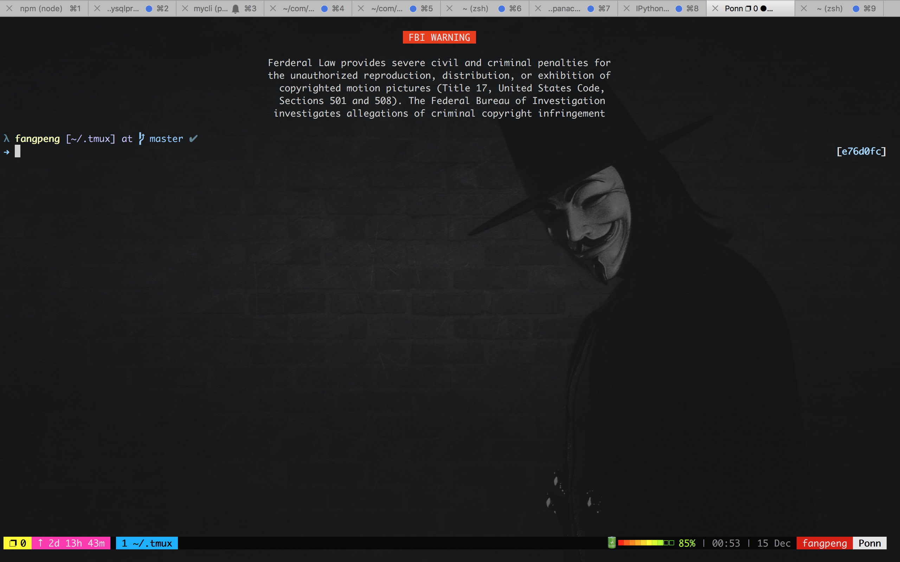
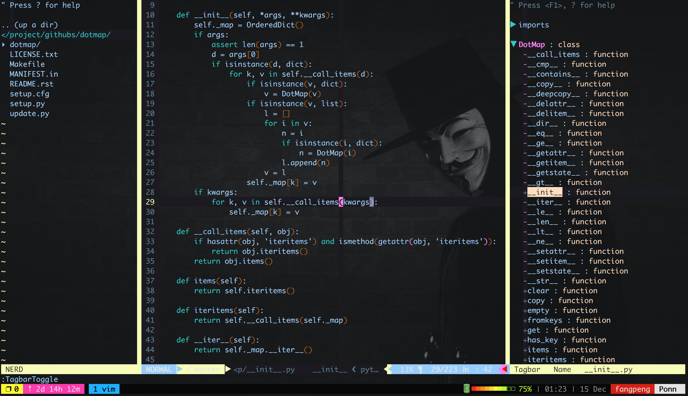

# terminals
The cool terminal for mac

- [item2](https://www.iterm2.com/)
- [Oh my zsh](https://github.com/robbyrussell/oh-my-zsh)
- [kvim](https://github.com/wklken/k-vim)
- [gpakosz/.tmux](https://github.com/gpakosz/.tmux)

# Snapshot

*My items2*

*my vim*

